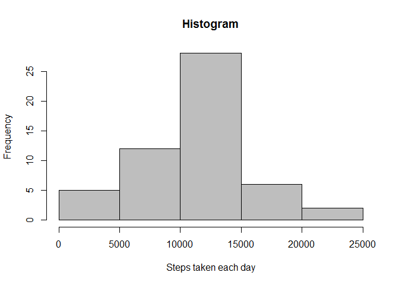
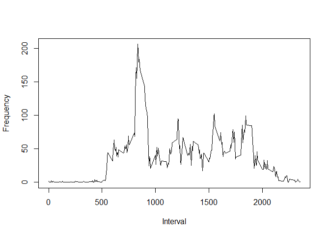
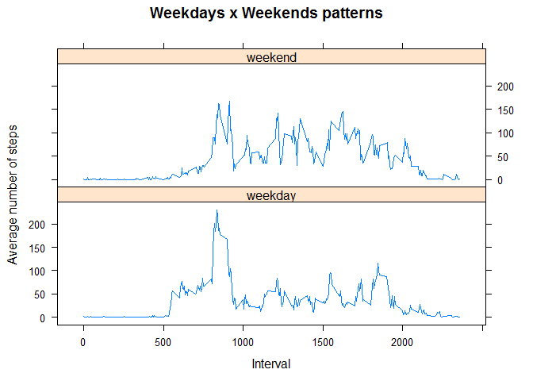

# Reproducible Research: Peer Assessment 1

## Introduction

It is now possible to collect a large amount of data about personal
movement using activity monitoring devices such as a
[Fitbit](http://www.fitbit.com), [Nike
Fuelband](http://www.nike.com/us/en_us/c/nikeplus-fuelband), or
[Jawbone Up](https://jawbone.com/up). These type of devices are part of
the "quantified self" movement -- a group of enthusiasts who take
measurements about themselves regularly to improve their health, to
find patterns in their behavior, or because they are tech geeks. But
these data remain under-utilized both because the raw data are hard to
obtain and there is a lack of statistical methods and software for
processing and interpreting the data.

This research makes use of data from a personal activity monitoring
device. This device collects data at 5 minute intervals through out the
day. The data consists of two months of data from an anonymous
individual collected during the months of October and November, 2012
and include the number of steps taken in 5 minute intervals each day.

## Data

Dataset: [Activity monitoring data](https://d396qusza40orc.cloudfront.net/repdata%2Fdata%2Factivity.zip) [52K]


|Variable | Description|
|---------|-----------------------------------------------------------------|
|steps|Number of steps taking in a 5-minute interval (missing values are coded as `NA`)|
|date|The date on which the measurement was taken in YYYY-MM-DD format|
|inverval|Identifier for the 5-minute interval in which measurement was taken|
    
## Loading and preprocessing the data

The file "activity.zip" contains the file "activity.csv" that represents the activity monitoring dataset.


```r
data.raw <- read.csv(unz("activity.zip","activity.csv"))
data.raw$date <- as.Date(data.raw$date)
```

## Analysis on steps taken per day (missing values ignored)

The histogram bellow shows the frequency of steps taken each day


```r
data.steps <- aggregate(steps ~ date, data.raw, sum)
hist(data.steps$steps, xlab = "Steps taken each day", col=8, main="Histogram")
```

<!-- -->

The mean and median values are slightly different:

```r
mean(data.steps$steps)
```

```
## [1] 10766.19
```

```r
median(data.steps$steps)
```

```
## [1] 10765
```

## Average daily activity pattern

The time series plot below shows the daily activity pattern considering the average number of steps taken per 5-minutes interval.

```r
data.interval <- aggregate(steps ~ interval, data.raw, mean)
plot(data.interval$interval,data.interval$steps,
     type = "l",
     xlab = "Interval",
     ylab = "Frequency")
```

<!-- -->

The 5-minute interval that, on average, contains the maximum number of steps:


```r
data.interval$interval[data.interval$steps == max(data.interval$steps)]
```

```
## [1] 835
```

## Imputing missing values
All the previous analysis ignored missing values.
Here is the total of missing values:

```r
sum(is.na(data.raw$steps))
```

```
## [1] 2304
```
Now we are going to replicate the original dataset and replace the missing values with the mean for that 5-minute interval.

```r
data.complete <- data.raw
naRows <- is.na(data.complete$steps)
data.complete$steps[naRows] <- sapply(data.complete$interval[naRows], function(x) {
as.integer(data.interval$steps[data.interval$interval==x])
})
```

Here is the histogram of the total number of steps taken each day after missing values replacement.

```r
data.csteps <- aggregate(steps ~ date, data.complete, sum)
hist(data.csteps$steps, xlab = "Steps taken each day", col=8, main="Histogram")
```

<!-- -->

```r
meanCSteps   <- mean(data.csteps$steps)
medianCSteps <- median(data.csteps$steps)
```

## Activity patterns - Weekdays x Weekends

There are differences in activity patterns between weekdays and weekends as you can see bellow.


```r
data.weekdays <- weekdays(data.complete$date)
data.weekdays[data.weekdays=="Saturday" | data.weekdays=="Sunday"] <- "weekend"
data.weekdays[data.weekdays!="weekend"] <- "weekday"
data.weekdays <- as.factor(data.weekdays)

data.wcomplete <- cbind(data.complete, data.weekdays)
names(data.wcomplete)[4] <-"datetype"
data.wsteps <- aggregate(data.wcomplete$steps,list(interval=data.wcomplete$interval,datetype=data.wcomplete$datetype),mean)
names(data.wsteps)[3] <-"steps"

library(lattice)

xyplot(steps~interval | datetype, data=data.wsteps,
  type = "l",
  main = "Weekdays x Weekends patterns",
  xlab = "Interval",
  ylab = "Average number of steps",
  layout = c(1,2))
```

<!-- -->
